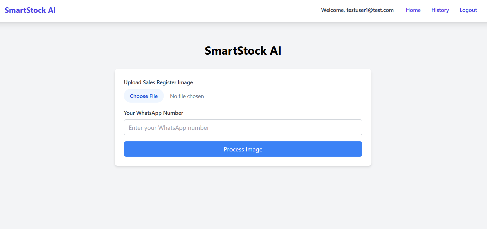
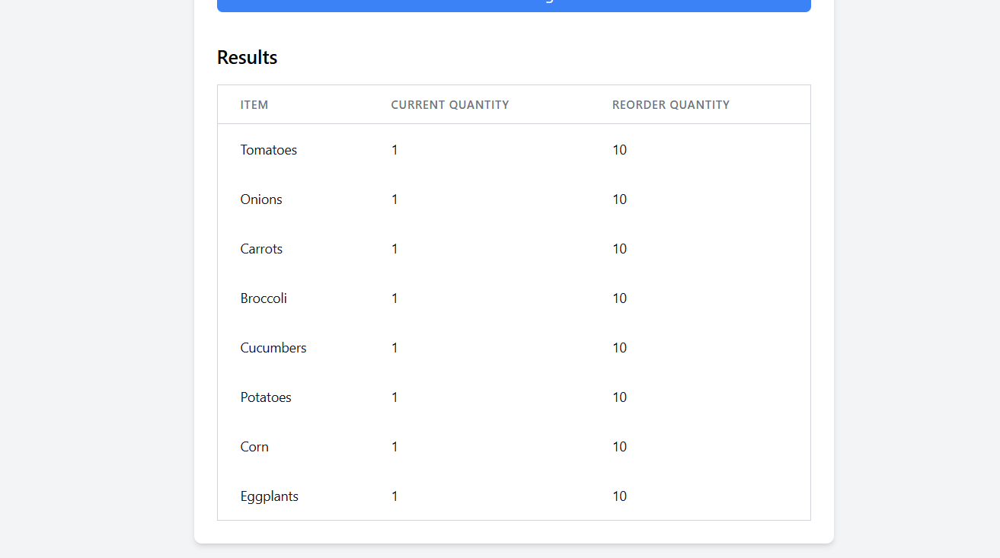
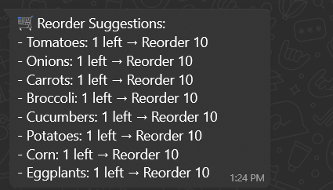

# 🛒 SmartStock AI

A web application that helps retail businesses manage inventory by processing sales register images and generating reorder suggestions.

## Features

- Upload sales register images (PNG, JPG, JPEG, GIF)
- Automatic item and quantity extraction using PaddleOCR
- Smart reorder suggestions based on stock levels
- Optional WhatsApp notifications for reorder suggestions
- User authentication and inventory history tracking
- Modern web interface with error handling and loading states

## Getting Started

### Prerequisites

- Python 3.12.10
- Required dependencies (install via requirements.txt)
- Twilio account for WhatsApp integration

### Installation

1. Clone the repository
   ```bash
   git clone https://github.com/yourusername/smartstock-ai.git
   cd smartstock-ai
   ```

2. Create and activate virtual environment
   ```bash
   python -m venv venv
   .\venv\Scripts\activate  # Windows
   ```

3. Install dependencies
   ```bash
   pip install -r requirements.txt
   ```

4. Set up environment variables
   Create a `.env` file with:
   ```
   TWILIO_ACCOUNT_SID=your_account_sid
   TWILIO_AUTH_TOKEN=your_auth_token
   TWILIO_WHATSAPP_NUMBER=your_twilio_number
   SECRET_KEY=your_secret_key
   ```

## Project Structure

```
smartstock-ai/
├── app.py              # Main Flask application
├── auth/               # Authentication routes and forms
├── inventory/          # Inventory management routes
├── messaging/          # WhatsApp messaging integration
├── models.py           # Database models
├── ocr/                # OCR processing code
├── corrector/          # Text correction using Gemini AI
├── static/             # Static files (CSS, JS, images)
├── templates/          # HTML templates
├── uploads/            # Image uploads
├── requirements.txt    # Python dependencies
└── .env                # Environment variables
```

## Technical Stack

### Backend
- **Framework**: Flask
- **Database**: SQLite (via SQLAlchemy)
- **Authentication**: Flask-Login
- **OCR**: PaddleOCR
- **Messaging**: Twilio WhatsApp API
- **AI**: Google Gemini for text correction

### Frontend
- **CSS**: Tailwind CSS
- **JavaScript**: Vanilla JS with Fetch API
- **Template Engine**: Jinja2

### Dependencies
```plaintext
Flask==2.3.3
Pillow==10.3.0
paddlepaddle==2.6.1
paddleocr==2.7.3
twilio==8.11.0
python-dotenv==1.0.1
numpy==1.26.4
setuptools>=65.5.0
```

## Project Structure
```
smartstock-ai/
├── app.py              # Main Flask application
├── ocr/                # OCR processing code
├── logic/              # Business logic
├── messaging/          # WhatsApp messaging
├── templates/          # HTML templates
├── uploads/            # Image uploads
├── static/             # Static files
├── requirements.txt    # Python dependencies
├── .env                # Environment variables
└── .gitignore          # Git ignore rules
```

## Security Considerations
- Environment variables for sensitive data
- File upload validation
- Error handling for OCR processing

## Future Enhancements

1. Advanced image preprocessing
2. Enhanced reorder prediction algorithms
3. Batch processing capabilities
4. Mobile app integration
5. Multi-language support
6. Advanced reporting features
7. Integration with popular accounting systems

## 📸 Demo

| Upload Interface         | Results Table            | WhatsApp Output         |
|--------------------------|---------------------------|--------------------------|
|  |  |  |

> *(Replace the `assets/` image links with your actual screenshot paths)*

---

## 🚀 How It Works

1. Shopkeeper uploads a register image
2. OCR engine extracts item names and quantities
3. AI logic decides what to reorder
4. Results shown on dashboard and optionally sent on WhatsApp

---

## 🛠️ Tech Stack

- **Frontend**: Streamlit / HTML + Tailwind CSS
- **Backend**: Flask / FastAPI (Python)
- **OCR**: Google Vision API / PaddleOCR
- **Messaging**: Twilio WhatsApp Sandbox
- **Hosting**: Render / Railway / Replit

---

## ⚙️ Installation

```bash
# Clone the repo
git clone https://github.com/yourusername/smartstock-ai.git
cd smartstock-ai

# Install dependencies
pip install -r requirements.txt

# Run the app
python app.py
